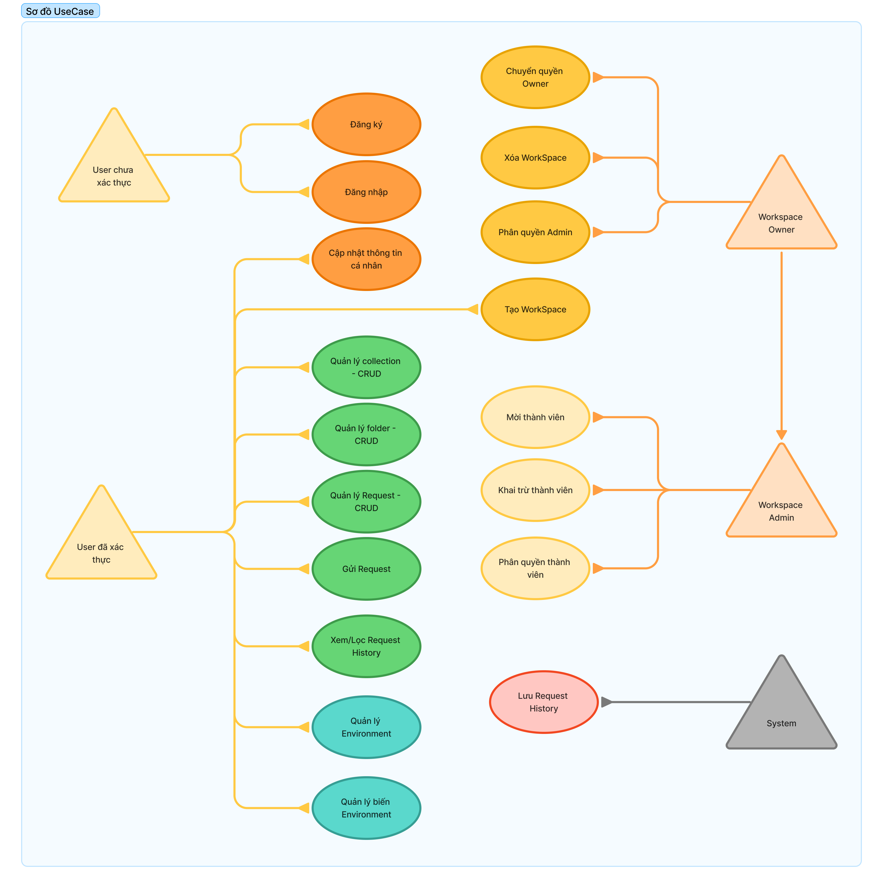
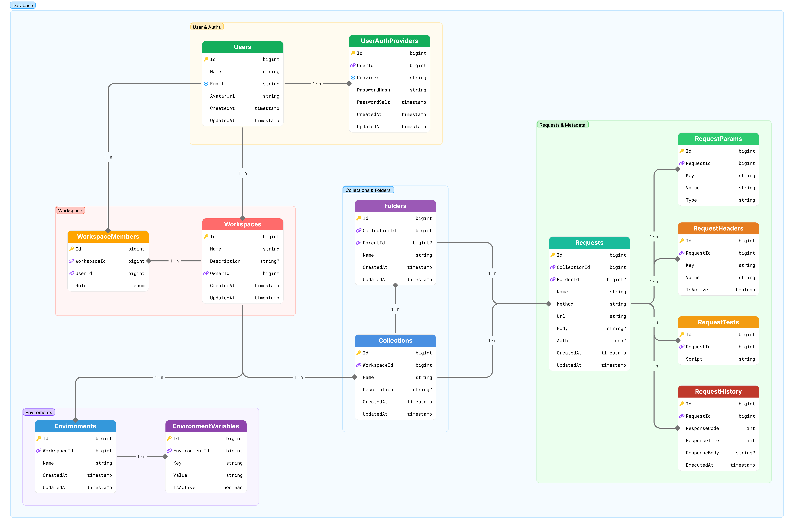

# 📑 Use Case Specification - Postman Clone

## 🔗 Sơ đồ tham chiếu

- **Use Case Diagram**: 
- **Database ERD**: 
---

## UC-01: Đăng ký
- **Actor**: User chưa xác thực
- **Mục đích**: Tạo tài khoản mới
- **Preconditions**: Email chưa tồn tại
- **Main Flow**:
  1. User nhập email, mật khẩu, tên
  2. Hệ thống hash mật khẩu và lưu `Users`, `UserAuthProviders`
- **Alternative Flow**:
  - Email đã tồn tại → báo lỗi
- **Postconditions**: User mới được tạo
- **Database**: `Users`, `UserAuthProviders`

---

## UC-02: Đăng nhập
- **Actor**: User chưa xác thực
- **Mục đích**: Xác thực để truy cập hệ thống
- **Preconditions**: User đã đăng ký
- **Main Flow**:
  1. User nhập email và mật khẩu
  2. Hệ thống xác thực mật khẩu
  3. Sinh Access Token, Refresh Token
- **Alternative Flow**:
  - Sai email hoặc mật khẩu → báo lỗi
- **Postconditions**: User có phiên đăng nhập hợp lệ
- **Database**: `UserAuthProviders`, `UserSessions` (nếu có)

---

## UC-03: Cập nhật thông tin cá nhân
- **Actor**: User đã xác thực
- **Mục đích**: Thay đổi tên, avatar
- **Preconditions**: User đã đăng nhập
- **Main Flow**: User cập nhật profile → update bảng `Users`
- **Postconditions**: Thông tin user được cập nhật
- **Database**: `Users`

---

## UC-04: Tạo Workspace
- **Actor**: User đã xác thực
- **Mục đích**: Tạo không gian làm việc mới
- **Preconditions**: User đã đăng nhập
- **Main Flow**:
  1. User nhập tên, mô tả
  2. Hệ thống tạo record `Workspaces`
  3. Gán User là Owner trong `WorkspaceMembers`
- **Postconditions**: Workspace mới được tạo, User trở thành Owner
- **Database**: `Workspaces`, `WorkspaceMembers`

---

## UC-05: Quản lý Collection (CRUD)
- **Actor**: User đã xác thực
- **Mục đích**: Tạo, xem, sửa, xóa Collection
- **Preconditions**: User thuộc một Workspace
- **Main Flow**:
  - CRUD trên `Collections`
- **Postconditions**: Collection được cập nhật
- **Database**: `Collections`

---

## UC-06: Quản lý Folder (CRUD)
- **Actor**: User đã xác thực
- **Mục đích**: Quản lý thư mục trong Collection
- **Preconditions**: Collection đã tồn tại
- **Main Flow**:
  - CRUD trên `Folders`
- **Postconditions**: Folder được cập nhật
- **Database**: `Folders`

---

## UC-07: Quản lý Request (CRUD)
- **Actor**: User đã xác thực
- **Mục đích**: Quản lý request trong Collection/Folder
- **Preconditions**: Collection/Folder đã tồn tại
- **Main Flow**:
  - CRUD trên `Requests`, `RequestHeaders`, `RequestParams`, `RequestTests`
- **Postconditions**: Request được cập nhật
- **Database**: `Requests`, `RequestHeaders`, `RequestParams`, `RequestTests`

---

## UC-08: Gửi Request
- **Actor**: User đã xác thực
- **Mục đích**: Thực thi request
- **Preconditions**: Request đã tồn tại
- **Main Flow**:
  1. User chọn request và bấm **Send**
  2. Hệ thống resolve biến từ `EnvironmentVariables`
  3. Hệ thống gửi HTTP request
  4. Nhận response và hiển thị cho User
  5. Lưu response vào `RequestHistory`
- **Alternative Flow**:
  - Biến không tồn tại → báo lỗi
  - Request timeout → báo lỗi timeout
- **Postconditions**: RequestHistory có bản ghi mới
- **Database**: `Requests`, `EnvironmentVariables`, `RequestHistory`

---

## UC-09: Xem/Lọc Request History
- **Actor**: User đã xác thực
- **Mục đích**: Xem kết quả các lần gửi request trước
- **Preconditions**: Có lịch sử request
- **Main Flow**:
  - User chọn Request → hệ thống load từ `RequestHistory`
- **Postconditions**: User xem được lịch sử
- **Database**: `RequestHistory`

---

## UC-10: Quản lý Environment (CRUD)
- **Actor**: User đã xác thực
- **Mục đích**: Quản lý environment (Dev, Staging, Prod)
- **Main Flow**:
  - CRUD trên `Environments`
- **Postconditions**: Environment được cập nhật
- **Database**: `Environments`

---

## UC-11: Quản lý biến Environment (CRUD)
- **Actor**: User đã xác thực
- **Mục đích**: Quản lý biến key-value trong Environment
- **Preconditions**: Environment đã tồn tại
- **Main Flow**:
  - CRUD trên `EnvironmentVariables`
- **Postconditions**: EnvironmentVariables được cập nhật
- **Database**: `EnvironmentVariables`

---

## UC-12: Mời thành viên
- **Actor**: Workspace Admin
- **Mục đích**: Mời User khác vào Workspace
- **Main Flow**: Insert `WorkspaceMembers(UserId, WorkspaceId, Role=member)`
- **Postconditions**: User mới có quyền trong Workspace
- **Database**: `WorkspaceMembers`

---

## UC-13: Khai trừ thành viên
- **Actor**: Workspace Admin
- **Mục đích**: Loại bỏ thành viên khỏi Workspace
- **Main Flow**: Delete record trong `WorkspaceMembers`
- **Postconditions**: User bị loại khỏi Workspace
- **Database**: `WorkspaceMembers`

---

## UC-14: Phân quyền thành viên
- **Actor**: Workspace Admin
- **Mục đích**: Gán role cho thành viên (member/viewer)
- **Main Flow**: Update `WorkspaceMembers.Role`
- **Postconditions**: Role mới có hiệu lực
- **Database**: `WorkspaceMembers`

---

## UC-15: Phân quyền Admin
- **Actor**: Workspace Owner
- **Mục đích**: Gán quyền admin cho User trong Workspace
- **Main Flow**: Update `WorkspaceMembers.Role = Admin`
- **Postconditions**: User có quyền Admin
- **Database**: `WorkspaceMembers`

---

## UC-16: Xóa Workspace
- **Actor**: Workspace Owner
- **Mục đích**: Xóa toàn bộ Workspace
- **Main Flow**: Delete record trong `Workspaces` và cascade dữ liệu
- **Postconditions**: Workspace bị xóa
- **Database**: `Workspaces`, `Collections`, `Folders`, `Requests`

---

## UC-17: Chuyển quyền Owner
- **Actor**: Workspace Owner
- **Mục đích**: Chuyển quyền sở hữu cho User khác
- **Main Flow**: Update `WorkspaceMembers` để đổi role Owner
- **Postconditions**: User khác trở thành Owner
- **Database**: `WorkspaceMembers`

---

## UC-18: Lưu Request History (System)
- **Actor**: System
- **Mục đích**: Ghi lại kết quả mỗi lần gửi request
- **Main Flow**: Insert bản ghi vào `RequestHistory`
- **Postconditions**: Có record mới trong lịch sử
- **Database**: `RequestHistory`
