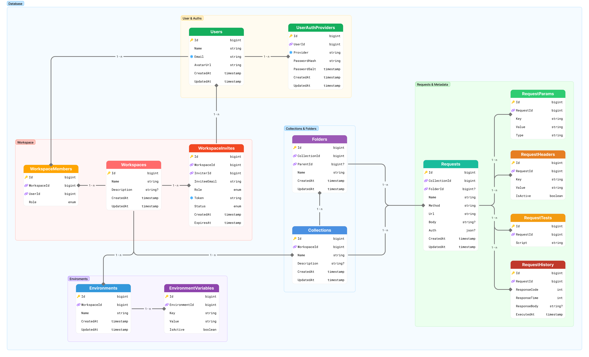

# Mô Hình Thực Thể (Entity Framework Core)

Neo Postman sử dụng Entity Framework Core (code-first) với provider `Npgsql` để ánh xạ domain model sang PostgreSQL. File này mô tả các entity chính, thuộc tính và quan hệ nhằm hỗ trợ việc hiện thực DbContext và migration.

## Cấu hình chung
- **Provider**: `Npgsql.EntityFrameworkCore.PostgreSQL`
- **Chiến lược key**: Khóa chính sử dụng kiểu `long` (bigint) sinh bởi `YitIdHelper.NextId()` theo cơ chế Snowflake và cấu hình `ValueGeneratedOnAdd()`.
- **Audit field**: `CreatedAt`, `UpdatedAt` được cấu hình trong `SaveChanges` hoặc qua interceptor.
- **Soft delete**: Thuộc tính `IsDeleted` + `DeletedAt` trên thực thể cần lưu trữ lịch sử.

## Danh sách entity
| Entity | Thuộc tính chính | Quan hệ |
| --- | --- | --- |
| `User` | `Id`, `Email`, `PasswordHash`, `DisplayName`, `AvatarUrl`, `Timezone`, `IsActive`, `CreatedAt`, `UpdatedAt` | 1-n với `UserAuthProvider`, `UserSession`, `WorkspaceMember`, `Request`, `RequestHistory` |
| `UserAuthProvider` | `Id`, `UserId`, `Provider`, `ProviderKey`, `CreatedAt` | n-1 tới `User` |
| `UserSession` | `Id`, `UserId`, `RefreshToken`, `UserAgent`, `IpAddress`, `ExpiresAt`, `CreatedAt`, `RevokedAt` | n-1 tới `User` |
| `Workspace` | `Id`, `Name`, `Code`, `Description`, `Visibility`, `CreatedBy`, `CreatedAt`, `UpdatedAt`, `IsDeleted`, `DeletedAt` | 1-n với `WorkspaceMember`, `Collection`, `Environment`, `AuditLog` |
| `WorkspaceMember` | `Id`, `WorkspaceId`, `UserId`, `Role`, `InvitationStatus`, `InvitedBy`, `CreatedAt`, `UpdatedAt` | n-1 tới `Workspace`, n-1 tới `User` |
| `Collection` | `Id`, `WorkspaceId`, `Name`, `Description`, `CreatedBy`, `CreatedAt`, `UpdatedAt` |  n-1 tới `Workspace`, 1-n với `Folder`, `Request` |
| `Folder` | `Id`, `CollectionId`, `ParentId`, `Name`, `Position`, `CreatedAt`, `UpdatedAt` | n-1 tới `Collection`, self-reference tới `Parent` |
| `Request` | `Id`, `CollectionId`, `FolderId`, `Name`, `Method`, `Url`, `Description`, `CreatedBy`, `UpdatedBy`, `CreatedAt`, `UpdatedAt` | n-1 tới `Collection`/`Folder`, 1-n với `RequestHeader`, `RequestParam`, `RequestBody`, `RequestTest`, `RequestHistory` |
| `RequestHeader` | `Id`, `RequestId`, `Key`, `Value`, `IsActive` | n-1 tới `Request` |
| `RequestParam` | `Id`, `RequestId`, `Key`, `Value`, `IsActive` | n-1 tới `Request` |
| `RequestBody` | `Id`, `RequestId`, `BodyMode`, `BodyContent`, `CreatedAt`, `UpdatedAt` | n-1 tới `Request` |
| `RequestTest` | `Id`, `RequestId`, `ScriptLanguage`, `ScriptContent`, `CreatedAt`, `UpdatedAt` | n-1 tới `Request` |
| `Environment` | `Id`, `WorkspaceId`, `Name`, `Description`, `IsDefault`, `CreatedBy`, `CreatedAt`, `UpdatedAt` | n-1 tới `Workspace`, 1-n với `EnvironmentVariable`, n-1 tới `RequestHistory` |
| `EnvironmentVariable` | `Id`, `EnvironmentId`, `Key`, `Value`, `IsSecret`, `CreatedAt`, `UpdatedAt` | n-1 tới `Environment` |
| `RequestHistory` | `Id`, `RequestId`, `EnvironmentId`, `ExecutedBy`, `StatusCode`, `ResponseTimeMs`, `ResponseSize`, `RequestPayload`, `ResponseBody`, `ResponseHeaders`, `ErrorMessage`, `ExecutedAt` | n-1 tới `Request`, n-1 tới `Environment`, n-1 tới `User` |
| `AuditLog` | `Id`, `WorkspaceId`, `ActorId`, `Action`, `Metadata`, `CreatedAt` | n-1 tới `Workspace`, n-1 tới `User` (có thể null) |

## Ràng buộc và cấu hình Fluent API
- `HasIndex` trên `WorkspaceMember (WorkspaceId, UserId)` với Unique để ngăn trùng thành viên.
- `HasIndex` trên `RequestHistory (RequestId, ExecutedAt)` để tối ưu truy vấn lịch sử.
- `HasOne().WithMany()` cấu hình cascade delete theo yêu cầu nghiệp vụ (ví dụ: xóa workspace => cascade collections, environments, members).
- Sử dụng `builder.Property(x => x.Email).HasColumnType("citext")` cho `User.Email` nhằm hỗ trợ so khớp không phân biệt hoa thường.
- Ánh xạ enum `WorkspaceRole` sang cột PostgreSQL enum thông qua `builder.Property(x => x.Role).HasConversion<string>()` hoặc sử dụng `Npgsql` enum mapping.

## Migration & seeding
- Tạo migration bằng `dotnet ef migrations add <TenMigration>` và commit cùng mã nguồn.
- Seed dữ liệu hệ thống (ví dụ role mặc định) trong `ModelBuilder.Seed()` hoặc migration đầu tiên.
- Sử dụng `Database.Migrate()` khi khởi động ứng dụng để bảo đảm schema tương thích.

## Tham chiếu thêm
- [Kế hoạch Migration](migrations.md)
- [Quy tắc đặt tên](naming-conventions.md)
- ERD: 

