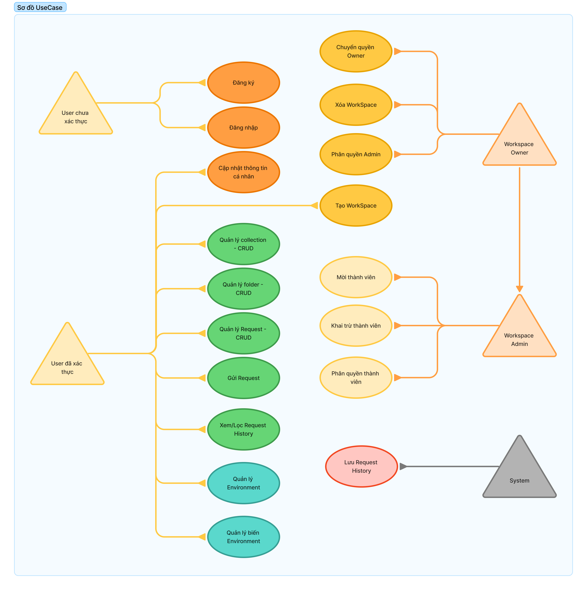

# Đặc Tả Yêu Cầu Phần Mềm (SRS) – Neo Postman

## 1. Giới thiệu
### 1.1 Mục đích
Tài liệu SRS mô tả mục tiêu kinh doanh, phạm vi chức năng và các yêu cầu phi chức năng của Neo Postman. Đây là nguồn tham chiếu chính cho đội sản phẩm, phát triển, QA và vận hành.

### 1.2 Phạm vi
Neo Postman là nền tảng SaaS giúp cá nhân và nhóm tạo, gửi, kiểm thử và chia sẻ request HTTP trong các workspace. Phạm vi bao gồm ứng dụng web, API backend, dịch vụ nền và các thành phần hạ tầng hỗ trợ.

### 1.3 Tài liệu tham chiếu
- README tổng quan: [../../README.md](../../README.md)
- Use Case Diagram:   
- Mô hình thực thể: [entity-models.md](entity-models.md)
- Thay đổi Use Case ↔ dữ liệu: [UseCaseChanges.md](UseCaseChanges.md)

### 1.4 Thuật ngữ và viết tắt
| Thuật ngữ | Định nghĩa |
| --- | --- |
| Workspace | Không gian làm việc chứa collection, environment và thành viên. |
| Collection | Tập hợp các folder/request thuộc một workspace. |
| Environment | Bộ biến key-value dùng thay thế khi gửi request. |
| Request History | Nhật ký các lần thực thi request. |
| Owner | Thành viên có toàn quyền trong workspace. |
| Admin | Thành viên được phép quản trị nhưng không xóa workspace. |
| Refresh Token | Mã mở rộng phiên lưu trong `UserSessions`. |

## 2. Mô tả tổng thể
### 2.1 Bối cảnh hệ thống
Neo Postman hoạt động như một hệ thống độc lập gồm SPA front-end và API backend RESTful. Hệ thống tích hợp dịch vụ email để gửi lời mời/xác minh và có thể kết nối các công cụ giám sát khi vận hành.

### 2.2 Chức năng chính
- Đăng ký, xác minh email, đăng nhập và quản lý phiên người dùng (refresh token, thiết bị).
- Tạo và tổ chức workspace, quản lý thành viên theo vai trò.
- Quản lý collection, folder, request cùng metadata (params, headers, tests).
- Quản lý environment và biến, bật/tắt biến theo `IsActive`.
- Thực thi request, lưu lịch sử và xem kết quả theo nhiều dạng.
- Hỗ trợ các tác vụ cộng tác: mời thành viên, chuyển quyền, phân quyền chi tiết.

### 2.3 Phân loại người dùng
| Lớp người dùng | Mô tả | Mục tiêu chính |
| --- | --- | --- |
| Khách | Người chưa đăng nhập. | Đăng ký, xác minh email để tham gia. |
| Thành viên | Người dùng đã xác thực, thuộc một hoặc nhiều workspace. | Quản lý tài sản và gửi request. |
| Workspace Admin | Thành viên có quyền quản trị workspace. | Quản lý thành viên, cấu trúc dữ liệu. |
| Workspace Owner | Quyền cao nhất trong workspace. | Chuyển quyền, xóa workspace, nâng quyền admin. |
| Hệ thống | Dịch vụ nền tự động. | Lưu lịch sử, gửi email, dọn dẹp dữ liệu. |

### 2.4 Môi trường vận hành
- Front-end: SPA hỗ trợ Chrome, Edge, Firefox, Safari (hai phiên bản gần nhất).
- Backend: .NET 8 API chạy dạng container.
- CSDL: PostgreSQL 15+ (ưu tiên) hoặc SQL Server 2019+.
- Hạ tầng: Kubernetes/Azure App Service, hỗ trợ auto scaling.

### 2.5 Ràng buộc
- Tuân thủ chuẩn bảo mật nội bộ và OWASP ASVS Level 2.
- Bí mật (password/secret) lưu trong kho bảo mật (Azure Key Vault/AWS Secrets Manager).
- Giai đoạn hiện tại chỉ hỗ trợ request HTTP/HTTPS.

### 2.6 Giả định và phụ thuộc
- Dịch vụ email sẵn sàng để gửi thông báo và lời mời.
- Có thể tích hợp OAuth (Google, GitHub) ở giai đoạn sau.
- API outbound được phép truy cập Internet để thực thi request.

## 3. Yêu cầu chức năng
### 3.1 Xác thực và danh tính
| ID | Mô tả |
| --- | --- |
| FR-A-01 | Hệ thống cho phép đăng ký bằng email, mật khẩu, tên hiển thị. |
| FR-A-02 | Mật khẩu phải được băm (PBKDF2/Argon2) trước khi lưu vào `UserAuthProviders`. |
| FR-A-03 | Sau đăng ký, hệ thống tạo token xác minh trong `UserVerificationTokens` và gửi email. |
| FR-A-04 | Đăng nhập trả về access token + refresh token; refresh token băm lưu trong `UserSessions`. |
| FR-A-05 | Cho phép đăng xuất/kết thúc phiên bằng cách xóa dòng tương ứng trong `UserSessions`. |
| FR-A-06 | Hệ thống khóa đăng nhập nếu `Users.IsDisabled = true` hoặc email chưa xác minh. |

### 3.2 Workspace và thành viên
| ID | Mô tả |
| --- | --- |
| FR-W-01 | Thành viên xác thực được tạo workspace với `Name`, `Description?`. |
| FR-W-02 | Người tạo workspace mặc định trở thành Owner trong `WorkspaceMembers`. |
| FR-W-03 | Owner/Admin mời thành viên qua `WorkspaceInvites` (token, role, expires). |
| FR-W-04 | Chấp nhận lời mời tạo bản ghi `WorkspaceMembers` mới với vai trò tương ứng. |
| FR-W-05 | Owner chuyển quyền sở hữu bằng cách cập nhật `WorkspaceMembers.Role`. |
| FR-W-06 | Owner xóa workspace và dữ liệu liên quan (collection, environment, request, history). |
| FR-W-07 | Owner/Admin loại bỏ thành viên khỏi `WorkspaceMembers`. |
| FR-W-08 | Owner/Admin thay đổi role thành viên (`Role enum`). |

### 3.3 Collection, folder, request
| ID | Mô tả |
| --- | --- |
| FR-C-01 | Thành viên tạo, cập nhật, nhân bản, xóa collection (`Collections`). |
| FR-C-02 | Thành viên quản lý folder theo cấu trúc cây trong `Folders` (`ParentId` nullable). |
| FR-C-03 | Thành viên tạo/cập nhật request (`Requests`) với metadata (`RequestParams`, `RequestHeaders`, `RequestTests`). |
| FR-C-04 | Hệ thống đảm bảo `Requests.FolderId` (nếu có) thuộc cùng `CollectionId`. |
| FR-C-05 | Xóa collection hoặc folder phải cascade request và metadata liên quan, giữ `RequestHistory` theo chính sách. |

### 3.4 Environment và biến
| ID | Mô tả |
| --- | --- |
| FR-E-01 | Thành viên tạo, cập nhật, nhân bản, xóa environment (`Environments`). |
| FR-E-02 | Thành viên quản lý biến (`EnvironmentVariables`) với `IsActive` bật/tắt. |
| FR-E-03 | Engine thay thế biến active khi thực thi request. |
| FR-E-04 | Xóa environment phải xóa các biến liên quan. |

### 3.5 Thực thi và lịch sử request
| ID | Mô tả |
| --- | --- |
| FR-R-01 | Thành viên gửi request và nhận response thời gian thực. |
| FR-R-02 | Hệ thống ghi `RequestHistory` (ResponseCode, ResponseTime, ResponseBody, ExecutedAt). |
| FR-R-03 | Cho phép lọc/tra cứu lịch sử theo request, status code, khoảng thời gian. |
| FR-R-04 | Cho phép tải xuống lịch sử gần nhất ở định dạng CSV (<= 30 ngày). |

## 4. Truy vết Use Case
| ID | Tên | Actor chính | Mục tiêu | Liên kết |
| --- | --- | --- | --- | --- |
| UC-01 | Đăng ký | Khách | Tạo tài khoản, sinh token xác minh. | [UC-01_SignUp](use-case-specs/UC-01_SignUp.md) |
| UC-02 | Đăng nhập | Thành viên | Xác thực, tạo `UserSessions`. | [UC-02_Login](use-case-specs/UC-02_Login.md) |
| UC-03 | Cập nhật hồ sơ | Thành viên | Đổi tên, avatar, email. | [UC-03_UpdateProfile](use-case-specs/UC-03_UpdateProfile.md) |
| UC-04 | Tạo workspace | Thành viên | Tạo workspace mới, gán Owner. | [UC-04_CreateWorkspace](use-case-specs/UC-04_CreateWorkspace.md) |
| UC-05 | Quản lý collection | Thành viên | CRUD collection và cascade. | [UC-05_ManageCollections](use-case-specs/UC-05_ManageCollections.md) |
| UC-06 | Quản lý folder | Thành viên | CRUD folder cây. | [UC-06_ManageFolders](use-case-specs/UC-06_ManageFolders.md) |
| UC-07 | Quản lý request | Thành viên | CRUD request + metadata. | [UC-07_ManageRequests](use-case-specs/UC-07_ManageRequests.md) |
| UC-08 | Gửi request | Thành viên | Thực thi request với biến. | [UC-08_SendRequest](use-case-specs/UC-08_SendRequest.md) |
| UC-09 | Xem lịch sử request | Thành viên | Tra cứu `RequestHistory`. | [UC-09_ViewRequestHistory](use-case-specs/UC-09_ViewRequestHistory.md) |
| UC-10 | Quản lý environment | Thành viên | CRUD environment. | [UC-10_ManageEnvironments](use-case-specs/UC-10_ManageEnvironments.md) |
| UC-11 | Quản lý biến environment | Thành viên | CRUD biến, bật/tắt `IsActive`. | [UC-11_ManageEnvironmentVariables](use-case-specs/UC-11_ManageEnvironmentVariables.md) |
| UC-12 | Mời thành viên | Workspace Admin | Tạo `WorkspaceInvites`, theo dõi trạng thái. | [UC-12_InviteMember](use-case-specs/UC-12_InviteMember.md) |
| UC-13 | Loại thành viên | Workspace Admin | Gỡ thành viên khỏi `WorkspaceMembers`. | [UC-13_RemoveMember](use-case-specs/UC-13_RemoveMember.md) |
| UC-14 | Phân quyền thành viên | Workspace Admin | Cập nhật `WorkspaceMembers.Role`. | [UC-14_AssignMemberRole](use-case-specs/UC-14_AssignMemberRole.md) |
| UC-15 | Phong quyền Admin | Workspace Owner | Nâng role thành viên lên Admin. | [UC-15_PromoteWorkspaceAdmin](use-case-specs/UC-15_PromoteWorkspaceAdmin.md) |
| UC-16 | Xóa workspace | Workspace Owner | Xóa toàn bộ dữ liệu workspace. | [UC-16_DeleteWorkspace](use-case-specs/UC-16_DeleteWorkspace.md) |
| UC-17 | Chuyển quyền Owner | Workspace Owner | Trao quyền sở hữu. | [UC-17_TransferOwnership](use-case-specs/UC-17_TransferOwnership.md) |
| UC-18 | Ghi log lịch sử | Hệ thống | Lưu kết quả thực thi. | [UC-18_LogRequestHistory](use-case-specs/UC-18_LogRequestHistory.md) |

## 5. Yêu cầu phi chức năng
### 5.1 Hiệu năng
- NFR-P-01: API cốt lõi đáp ứng < 500 ms cho 95% request ở tải 500 người dùng đồng thời.
- NFR-P-02: Engine gửi request outbound trong vòng 200 ms sau thao tác người dùng.
- NFR-P-03: Phân trang giới hạn 100 bản ghi mỗi trang.

### 5.2 Bảo mật
- NFR-S-01: Mọi lưu lượng sử dụng HTTPS (TLS 1.2 trở lên).
- NFR-S-02: Không lưu hoặc log mật khẩu dạng plain text.
- NFR-S-03: Áp dụng RBAC cho từng tài nguyên workspace.
- NFR-S-04: Audit log ghi nhận đăng nhập, lời mời, chuyển quyền với timestamp và actor.

### 5.3 Sẵn sàng và tin cậy
- NFR-A-01: Uptime môi trường Production đạt 99.5%/tháng.
- NFR-A-02: Tự động backup CSDL tối thiểu mỗi 6 giờ.
- NFR-A-03: RPO 30 phút, RTO 2 giờ.

### 5.4 Bảo trì và mở rộng
- NFR-M-01: Codebase tuân thủ kiến trúc nhiều tầng (API, Application, Domain, Infrastructure).
- NFR-M-02: Node API phải stateless để scale ngang.
- NFR-M-03: Tính năng thử nghiệm bật/tắt qua feature flag.

### 5.5 Tuân thủ
- NFR-C-01: Dữ liệu PII tuân thủ nguyên tắc tối thiểu hóa theo GDPR.
- NFR-C-02: Thư viện bên thứ ba được quét lỗ hổng (OWASP Dependency Check).

## 6. Yêu cầu giao diện bên ngoài
### 6.1 Giao diện người dùng
- SPA responsive hỗ trợ dark/light mode.
- Sidebar workspace để điều hướng collection, environment, history.
- Request builder có tab Params, Headers, Body, Tests.
- Response viewer hỗ trợ raw, preview, cây JSON.

### 6.2 Giao diện API
- Endpoint REST chuẩn JSON dưới `/api/v1`.
- Xác thực bằng bearer token OAuth 2.0.
- Trả header rate limit: `X-Rate-Limit-Remaining`, `Retry-After`.

### 6.3 Giao diện dữ liệu
- Tích hợp SMTP hoặc dịch vụ email transactional cho lời mời/xác minh.
- Hỗ trợ webhook thông báo kết quả request (định hướng tương lai).

## 7. Yêu cầu dữ liệu
- Các bảng chính: `Users`, `UserSessions`, `UserVerificationTokens`, `UserAuthProviders`, `Workspaces`, `WorkspaceMembers`, `WorkspaceInvites`, `Environments`, `EnvironmentVariables`, `Collections`, `Folders`, `Requests`, `RequestParams`, `RequestHeaders`, `RequestTests`, `RequestHistory`.
- Trường nhạy cảm (mật khẩu, secret) phải được băm hoặc mã hóa; refresh token chỉ lưu dạng hash.
- Chi tiết thực thể, quan hệ và index: [entity-models.md](entity-models.md).
- Tham khảo [UseCaseChanges.md](UseCaseChanges.md) để đồng bộ logic nghiệp vụ ↔ dữ liệu.

## 8. Báo cáo và phân tích
- Cung cấp thống kê số lượng request theo status code ở cấp workspace (kế hoạch tương lai).
- Cho phép export lịch sử request dạng CSV trong 30 ngày gần nhất.

## 9. Tiêu chí nghiệm thu
- Mỗi yêu cầu chức năng được map với test case và pass QA.
- Không còn defect mức nghiêm trọng (sev 1/2) trước khi release Production.
- Pipeline triển khai phải có bước test unit, integration và E2E tự động.

## 10. Ma trận truy vết
| Module | Yêu cầu chính | Use Case |
| --- | --- | --- |
| Authentication | FR-A-01 – FR-A-06 | UC-01, UC-02 |
| Hồ sơ | FR-A-03, FR-A-04, FR-A-06 | UC-03 |
| Workspace | FR-W-01 – FR-W-08 | UC-04, UC-12, UC-13, UC-14, UC-15, UC-16, UC-17 |
| Collection & Request | FR-C-01 – FR-C-05 | UC-05, UC-06, UC-07 |
| Thực thi | FR-R-01 – FR-R-04 | UC-08, UC-09, UC-18 |
| Environment | FR-E-01 – FR-E-04 | UC-10, UC-11 |

## 11. Vấn đề mở
- Hỗ trợ GraphQL và WebSocket đang nằm ngoài phạm vi, sẽ đánh giá ở giai đoạn tiếp theo.
- API quản lý workspace dành cho automation đang được cân nhắc.
---
[← Trang trước: README](../../README.md) | [Trang sau: UseCaseChanges →](UseCaseChanges.md)
