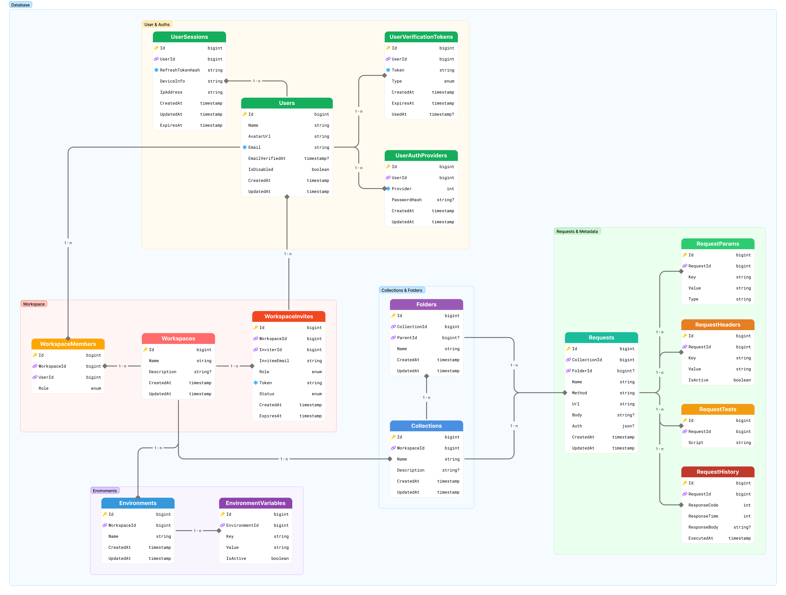

# Mô hình thực thể (Entity Model)

Tài liệu này mô tả chi tiết schema cơ sở dữ liệu Neo Postman theo thiết kế mới nhất. Mọi bảng, cột và quan hệ bên dưới bám sát danh sách đã chuẩn hóa; không bổ sung bảng hoặc cột ngoài phạm vi.

## Nguyên tắc chung
- **Kiểu dữ liệu**: sử dụng `bigint` cho khóa chính, `timestamp` cho dấu thời gian, `string`/`json` cho nội dung văn bản, `boolean` cho cờ trạng thái, `int` cho số nguyên.
- **Khóa chính**: mọi bảng đều có `Id bigint` (PK) sinh từ cơ chế Snowflake/YitId hoặc sequence tương đương.
- **Audit**: các cột `CreatedAt`, `UpdatedAt` được gán tự động khi ghi dữ liệu (nếu xuất hiện).
- **Enum**: các cột enum cần định nghĩa danh sách giá trị cụ thể (đánh dấu TODO).
- **Chỉ mục**: tối thiểu tạo index trên mọi khóa ngoại; bổ sung unique index khi cần kiểm soát trùng.

## Database ERD
  

## Chi tiết bảng

### 1. UserSessions
- **Mục đích**: Lưu phiên đăng nhập dài hạn (refresh token) theo thiết bị.
- **Cột**:
  - `Id bigint` – PK.
  - `UserId bigint` – FK → `Users.Id` (NOT NULL).
  - `RefreshTokenHash string` – băm refresh token.
  - `DeviceInfo string` – mô tả thiết bị.
  - `IpAddress string` – địa chỉ IP gần nhất.
  - `CreatedAt timestamp` – NOT NULL.
  - `UpdatedAt timestamp` – NOT NULL.
  - `ExpiresAt timestamp` – NOT NULL.
- **Chỉ mục**: `IX_UserSessions_UserId` (non-unique) phục vụ tra cứu theo người dùng.

### 2. Users
- **Mục đích**: Hồ sơ người dùng ứng dụng.
- **Cột**:
  - `Id bigint` – PK.
  - `Name string` – NOT NULL.
  - `AvatarUrl string` – lưu URL avatar.
  - `Email string` – NOT NULL.
  - `EmailVerifiedAt timestamp?` – có thể null cho tài khoản chưa xác minh.
  - `IsDisabled boolean` – đánh dấu khóa tài khoản.
  - `CreatedAt timestamp` – NOT NULL.
  - `UpdatedAt timestamp` – NOT NULL.
- **Ràng buộc/Chỉ mục**: đề xuất `UX_Users_Email` (unique) để ngăn trùng email.

### 3. UserVerificationTokens
- **Mục đích**: Quản lý token xác thực email, khôi phục, v.v.
- **Cột**:
  - `Id bigint` – PK.
  - `UserId bigint` – FK → `Users.Id` (NOT NULL).
  - `Token string` – giá trị token.
  - `Type enum` – loại token (`EmailConfirmation`, `PasswordReset`).
  - `CreatedAt timestamp` – NOT NULL.
  - `ExpiresAt timestamp` – thời hạn.
  - `UsedAt timestamp?` – thời điểm sử dụng (nullable).
- **Chỉ mục**: `IX_UserVerificationTokens_UserId`.

### 4. UserAuthProviders
- **Mục đích**: Lưu thông tin xác thực theo nhà cung cấp (mật khẩu nội bộ, SSO, ...).
- **Cột**:
  - `Id bigint` – PK.
  - `UserId bigint` – FK → `Users.Id` (NOT NULL).
  - `Provider string` – tên provider (`Password`, `Github`, `Google`).
  - `PasswordHash string` – băm mật khẩu (đối với provider `Password`).
  - `PasswordSalt string` – muối mật khẩu.
  - `CreatedAt timestamp` – NOT NULL.
  - `UpdatedAt timestamp` – NOT NULL.
- **Chỉ mục**: `IX_UserAuthProviders_UserId`; cân nhắc unique trên (`UserId`, `Provider`).

### 5. WorkspaceMembers
- **Mục đích**: Quan hệ thành viên – workspace và vai trò tương ứng.
- **Cột**:
  - `Id bigint` – PK.
  - `WorkspaceId bigint` – FK → `Workspaces.Id` (NOT NULL).
  - `UserId bigint` – FK → `Users.Id` (NOT NULL).
  - `Role enum` – vai trò trong workspace (`Viewer`, `Member`, `Admin`, `Owner`).
- **Chỉ mục**: `IX_WorkspaceMembers_WorkspaceId`, `IX_WorkspaceMembers_UserId`, unique `UX_WorkspaceMembers_Workspace_User` trên (`WorkspaceId`, `UserId`).

### 6. Workspaces
- **Mục đích**: Thực thể nhóm làm việc chứa collection, environment và thành viên.
- **Cột**:
  - `Id bigint` – PK.
  - `Name string` – NOT NULL.
  - `Description string?` – mô tả (nullable).
  - `CreatedAt timestamp` – NOT NULL.
  - `UpdatedAt timestamp` – NOT NULL.

### 7. WorkspaceInvites
- **Mục đích**: Lưu lời mời tham gia workspace.
- **Cột**:
  - `Id bigint` – PK.
  - `WorkspaceId bigint` – FK → `Workspaces.Id` (NOT NULL).
  - `InviterId bigint` – FK → `Users.Id` (NOT NULL).
  - `InviteeEmail string` – email người được mời.
  - `Role enum` – vai trò dự kiến. **TODO**: dùng chung danh sách với `WorkspaceMembers.Role`.
  - `Token string` – token lời mời.
  - `Status enum` – trạng thái `Pending`, `Accepted`, `Expired`, ... (**TODO** xác nhận danh sách đầy đủ).
  - `CreatedAt timestamp` – NOT NULL.
  - `ExpiresAt timestamp` – NOT NULL.
- **Chỉ mục**: `IX_WorkspaceInvites_WorkspaceId`, `IX_WorkspaceInvites_InviterId`; đề xuất unique trên `Token` và unique có điều kiện `(WorkspaceId, InviteeEmail)` cho trạng thái `Pending`.

### 8. Environments
- **Mục đích**: Tập cấu hình biến theo workspace.
- **Cột**:
  - `Id bigint` – PK.
  - `WorkspaceId bigint` – FK → `Workspaces.Id` (NOT NULL).
  - `Name string` – NOT NULL.
  - `CreatedAt timestamp` – NOT NULL.
  - `UpdatedAt timestamp` – NOT NULL.
- **Chỉ mục**: `IX_Environments_WorkspaceId`; cân nhắc unique `(WorkspaceId, Name)`.

### 9. EnvironmentVariables
- **Mục đích**: Biến key-value thuộc environment.
- **Cột**:
  - `Id bigint` – PK.
  - `EnvironmentId bigint` – FK → `Environments.Id` (NOT NULL).
  - `Key string` – NOT NULL.
  - `Value string` – NOT NULL.
  - `IsActive boolean` – bật/tắt biến.
- **Chỉ mục**: `IX_EnvironmentVariables_EnvironmentId`; đề xuất unique `(EnvironmentId, Key)`.

### 10. Collections
- **Mục đích**: Nhóm các request/folder trong workspace.
- **Cột**:
  - `Id bigint` – PK.
  - `WorkspaceId bigint` – FK → `Workspaces.Id` (NOT NULL).
  - `Name string` – NOT NULL.
  - `Description string?` – mô tả (nullable).
  - `CreatedAt timestamp` – NOT NULL.
  - `UpdatedAt timestamp` – NOT NULL.
- **Chỉ mục**: `IX_Collections_WorkspaceId`.

### 11. Folders
- **Mục đích**: Tổ chức request theo cây thư mục.
- **Cột**:
  - `Id bigint` – PK.
  - `CollectionId bigint` – FK → `Collections.Id` (NOT NULL).
  - `ParentId bigint?` – self FK → `Folders.Id` (nullable).
  - `Name string` – NOT NULL.
  - `CreatedAt timestamp` – NOT NULL.
  - `UpdatedAt timestamp` – NOT NULL.
- **Chỉ mục**: `IX_Folders_CollectionId`, `IX_Folders_ParentId`.

### 12. Requests
- **Mục đích**: Lưu định nghĩa request HTTP.
- **Cột**:
  - `Id bigint` – PK.
  - `CollectionId bigint` – FK → `Collections.Id` (NOT NULL).
  - `FolderId bigint?` – FK → `Folders.Id` (nullable, khi request thuộc folder).
  - `Name string` – NOT NULL.
  - `Method string` – NOT NULL.
  - `Url string` – NOT NULL.
  - `Body string?` – nội dung body (nullable).
  - `Auth json?` – cấu hình xác thực. **TODO**: đề xuất schema JSON `{type, credentials}`.
  - `CreatedAt timestamp` – NOT NULL.
  - `UpdatedAt timestamp` – NOT NULL.
- **Chỉ mục**: `IX_Requests_CollectionId`, `IX_Requests_FolderId`.

### 13. RequestParams
- **Mục đích**: Lưu tham số kèm request.
- **Cột**:
  - `Id bigint` – PK.
  - `RequestId bigint` – FK → `Requests.Id` (NOT NULL).
  - `Key string` – NOT NULL.
  - `Value string` – NOT NULL.
  - `Type string` – phân loại (query/path/header form). **TODO**: chuẩn hóa danh sách giá trị.
- **Chỉ mục**: `IX_RequestParams_RequestId`.

### 14. RequestHeaders
- **Mục đích**: Lưu header kèm request.
- **Cột**:
  - `Id bigint` – PK.
  - `RequestId bigint` – FK → `Requests.Id` (NOT NULL).
  - `Key string` – NOT NULL.
  - `Value string` – NOT NULL.
  - `IsActive boolean` – bật/tắt header.
- **Chỉ mục**: `IX_RequestHeaders_RequestId`.

### 15. RequestTests
- **Mục đích**: Lưu script kiểm thử sau request.
- **Cột**:
  - `Id bigint` – PK.
  - `RequestId bigint` – FK → `Requests.Id` (NOT NULL).
  - `Script string` – nội dung script.
- **Chỉ mục**: `IX_RequestTests_RequestId`.

### 16. RequestHistory
- **Mục đích**: Lưu kết quả thực thi request.
- **Cột**:
  - `Id bigint` – PK.
  - `RequestId bigint` – FK → `Requests.Id` (NOT NULL).
  - `ResponseCode int` – mã phản hồi.
  - `ResponseTime int` – thời gian phản hồi (ms).
  - `ResponseBody string?` – nội dung phản hồi (nullable).
  - `ExecutedAt timestamp` – thời điểm thực thi.
- **Chỉ mục**: `IX_RequestHistory_RequestId`.

## Tổng kết quan hệ chính
- Users 1 — n UserSessions
- Users 1 — n UserVerificationTokens
- Users 1 — n UserAuthProviders
- Workspaces 1 — n WorkspaceMembers
- Workspaces 1 — n WorkspaceInvites
- Workspaces 1 — n Collections
- Workspaces 1 — n Environments
- Environments 1 — n EnvironmentVariables
- Collections 1 — n Folders
- Collections 1 — n Requests
- Folders 1 — n Requests (Request.FolderId nullable)
- Requests 1 — n RequestParams
- Requests 1 — n RequestHeaders
- Requests 1 — n RequestTests
- Requests 1 — n RequestHistory

## Ghi chú bổ sung
- `ExpiresAt` trong `UserVerificationTokens` dùng `int` nên cần chuẩn hóa: nên lưu số giây kể từ `CreatedAt` hoặc chuyển sang `timestamp` nếu muốn thời gian tuyệt đối.
- `Auth json?` trong `Requests` cần tài liệu hóa schema để client/server đồng bộ (ví dụ: `{ "type": "basic", "credentials": { ... } }`).
- Các cột enum (`Type`, `Role`, `Status`) phải được định nghĩa rõ trong code base (TODO) để tránh sai lệch dữ liệu.
---
[← Trang trước: UC-18 Ghi log lịch sử](use-case-specs/UC-18_LogRequestHistory.md) | [Trang sau: Quy ước đặt tên Entity →](docs/srs/SRS.md)
